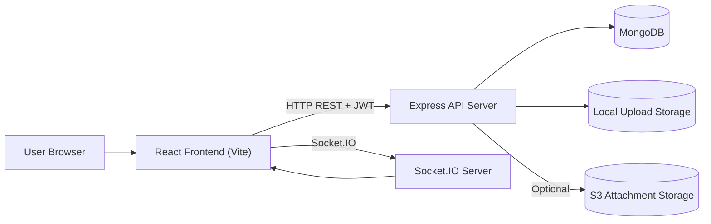
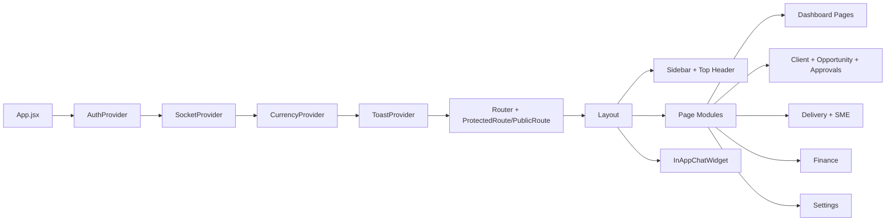
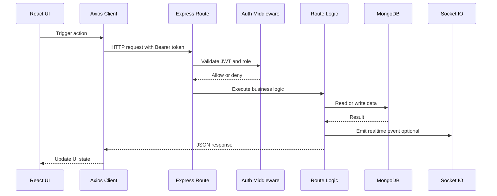
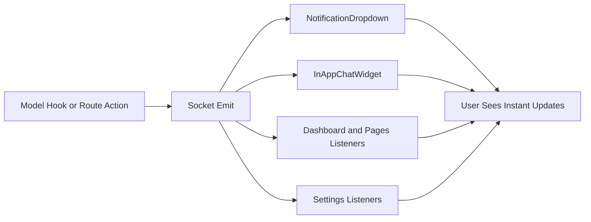
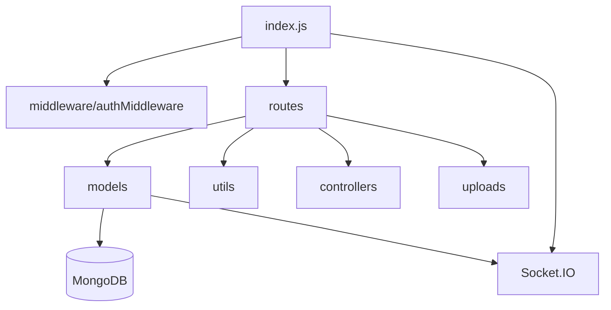

# GKTERP - End-to-End Project README

## 1. Project Overview
GKTERP is a role-based ERP web application used to manage the full business lifecycle of training/service opportunities from lead creation to delivery, finance tracking, approvals, and reporting.

It combines:
- Sales workflow (client + opportunity creation)
- Delivery workflow (execution data + delivery docs)
- Finance workflow (receivables + vendor payables)
- Approval workflow (GP/contingency escalation)
- Realtime communication (notifications + in-app chat)
- User settings and session/security preferences

## 2. Core Business Purpose
The project helps teams answer these operational questions in one system:
- Which clients and opportunities are active right now?
- What is the current stage/progress of each opportunity?
- Which opportunities need financial approval or escalation?
- What delivery/finance documents are missing?
- What is current GP performance by client, period, and team?
- What updates require realtime attention (notifications/chat)?

## 3. Technology Stack

### Frontend
- React 19
- Vite 7
- Tailwind CSS 4
- React Router 7
- Axios
- Socket.IO client
- Recharts
- Styled Components

### Backend
- Node.js + Express 5
- Mongoose (MongoDB ODM)
- JWT authentication
- Bcrypt password hashing
- Multer file upload handling
- Socket.IO server

### Database
- MongoDB

### Tooling
- Nodemon (backend dev)
- Concurrently (run frontend + backend together)
- ESLint
- Audit scripts in `scripts/`

## 4. High-Level Architecture

### Runtime architecture
1. Browser (React app) authenticates with backend via JWT.
2. JWT is stored in `sessionStorage` and attached as `Authorization: Bearer <token>`.
3. Express routes enforce `protect` + `authorize` middleware.
4. MongoDB stores core entities (`User`, `Client`, `Opportunity`, `Approval`, `Notification`, `SME`, `ChatMessage`).
5. Socket.IO pushes realtime events for:
   - entity changes (`entity_updated`)
   - notifications (`notification_received`)
   - chat events (`chat_message:*`, typing, read status)
   - settings sync (`settings_updated`)

### Repository architecture
- `client/` - React SPA
- `server/` - Express API + Socket.IO + Mongoose models
- `scripts/` - audit helper scripts
- `audit-logs/` - generated npm audit logs

## 4.1 Architecture Flows and Diagrams

### A. End-to-End Layered Architecture


### B. Frontend Internal Flow


### C. API Request Pipeline with Middleware


### D. Opportunity Lifecycle Processing Flow

```mermaid
graph LR;
  O1["Create Opportunity"] --> O2["Sales Updates Details"];
  O2 --> O3["Delivery Updates Expenses and Execution"];
  O3 --> O4["Finance Updates Receivables and Payables"];
  O4 --> O5["Approval Escalation if Required"];
  O5 --> O6["Approve or Reject"];
  O6 --> O7["Upload PO, Invoice, Delivery Docs"];
  O7 --> O8["Progress Recalculated"];
  O8 --> O9["Dashboard, Reports, Notifications"];
```


### E. Realtime Event Flow


### F. Backend Module Architecture

## 5. Role-Based Access Model
Primary roles used in flows:
- Sales Executive
- Sales Manager
- Business Head
- Director
- Delivery Head
- Delivery Executive
- Finance

Route access is enforced in frontend (protected routes) and backend (middleware authorization).

## 6. Main Functional Modules

### 6.1 Authentication and Session
- Login endpoint: `POST /api/auth/login`
- Valid credentials return JWT (12h) + user profile
- Session ID is generated and recorded in user security settings
- Frontend stores user and token in `sessionStorage`
- `ProtectedRoute` enforces auth + role-allowed navigation

### 6.2 User Management
- CRUD endpoints under `/api/users`
- Creator code generation by role prefix (E/M/D/F/B)
- Reporting manager hierarchy maintained for team-based visibility

### 6.3 Client Management
- Create/list/update/delete clients under `/api/clients`
- Duplicate check endpoint available
- Clients include sector + multiple contact persons
- Used as mandatory base entity for opportunity creation

### 6.4 Opportunity Management (Core Domain)
- Central module under `/api/opportunities`
- Supports:
  - Create opportunities with generated `opportunityNumber`
  - Role-aware listing and visibility
  - Update base/common/type-specific/finance fields
  - Stage/status transitions with validations
  - File uploads (proposal, requirement, PO, invoice, finance, delivery, expense docs)
  - Soft delete with safety rules

Progress model is auto-calculated using `progressCalculator` into:
- `progressPercentage`
- `statusStage`
- `statusLabel`

### 6.5 Approval and Escalation Workflow
- Endpoints under `/api/approvals`
- Triggered when GP/contingency rules require escalation
- Multi-level approvals assigned by role:
  - Manager
  - Business Head
  - Director
- Outcomes:
  - Approved: opportunity approval status updated
  - Rejected: cycle closed with rejection reason
- Approval actions emit notifications

### 6.6 Dashboard and Analytics
- Endpoints under `/api/dashboard`
- Provides:
  - KPI stats
  - client health
  - opportunity tracking and next actions
  - manager/team performance
  - business-head team structure
  - delivery revamp stats

Frontend has role-specific dashboards:
- Sales Executive
- Sales Manager
- Business Head
- Director
- Delivery
- Finance

### 6.7 Finance Module
- Finance pages use opportunity finance structures:
  - Client receivables
  - Vendor payables (detailed by expense category)
- Finance documents uploaded via `/api/opportunities/:id/upload-finance-doc`
- Finance and delivery/sales roles collaborate depending on section permissions

### 6.8 SME Management
- Endpoints under `/api/smes`
- Supports company/freelancer SME records
- Includes KYC/compliance docs (PAN/GST/SOW/NDA/profile)
- Soft delete via `isActive`

### 6.9 Notification System (Realtime)
- Endpoints under `/api/notifications`
- Notification records created by business actions (opportunity, docs, approvals, targets, etc.)
- Model middleware emits realtime `notification_received`
- Frontend dropdown supports filtering, mark-read, mark-all-read, and deep-link navigation

### 6.10 In-App Chat (Realtime + File Sharing)
- Endpoints under `/api/chat`
- Features:
  - user list + conversation list
  - send text + attachments
  - large file chunk uploads
  - reply, edit, delete (self/everyone), forward
  - mark conversation read
  - typing indicators over socket
- Storage providers:
  - Local (default)
  - Optional S3 mode via env configuration

### 6.11 Settings and Profile
- Endpoints under `/api/settings`
- Supports:
  - profile/preferences/workspace updates
  - avatar data URL storage
  - password change/reset request
  - session list and revoke
  - locale sync timestamp
  - profile/data export
  - account deactivation request
- Settings updates emit realtime `settings_updated`

### 6.12 Reports
- `/api/reports/gp-analysis`
- `/api/reports/vendor-expenses`
- Used by report widgets/charts for business and finance decision support

## 7. End-to-End Working Flow (Business Lifecycle)

### Flow A: User Login to Dashboard
1. User opens `/login`.
2. Frontend sends credentials to `/api/auth/login`.
3. Backend validates user + password, issues JWT, stores login session metadata.
4. Frontend saves token/user in session storage.
5. User is routed to role-default dashboard.
6. Socket client connects and joins user room for realtime events.

### Flow B: Client to Opportunity Creation
1. Sales user creates client record.
2. Sales opens opportunity creation modal.
3. System generates unique opportunity number (`GKT...`).
4. Opportunity is saved with base details + creator hierarchy mapping.
5. Delivery leadership is notified about new opportunity.

### Flow C: Opportunity Execution Lifecycle
1. Sales updates sales-side sections (requirements, type-specific, revenue inputs).
2. Delivery updates execution/expense/delivery sections.
3. Finance updates receivables/payables details and uploads docs.
4. System recalculates progress + stage labels automatically.
5. Activity logs and notifications track key transitions.

### Flow D: Escalation and Approval
1. If GP/contingency thresholds require review, escalation request is raised.
2. Approval records are created for required hierarchy levels.
3. Assigned approvers review and approve/reject.
4. Opportunity approval state is updated.
5. Requester gets realtime notification.

### Flow E: Completion and Reporting
1. PO/invoice/delivery docs are uploaded.
2. Opportunity reaches higher completion stages (up to 100%).
3. Dashboard and report endpoints aggregate performance.
4. Leadership tracks KPIs, team targets, GP, and vendor spending.

### Flow F: Cross-Cutting Realtime Loop
1. Backend model hooks and route logic emit socket events.
2. Frontend listeners refresh module state where required.
3. Users see live updates for notifications, chat, and entity changes.

## 8. Data Model Summary
Main entities:
- `User`: identity, role, hierarchy, targets, settings, sessions
- `Client`: company, sector, contact persons, owner
- `Opportunity`: lifecycle master entity (sales + delivery + finance + approval + docs + progress)
- `Approval`: approval records per trigger and approval level
- `Notification`: user-targeted event stream
- `SME`: vendor/resource master with compliance docs
- `ChatMessage`: conversation messages with attachments and message state controls

## 9. API Surface (By Module)
- `/api/auth` - login
- `/api/users` - user CRUD
- `/api/clients` - client CRUD
- `/api/opportunities` - opportunity lifecycle and docs
- `/api/dashboard` - KPIs and analytics
- `/api/approvals` - escalation approvals
- `/api/targets` - user target management
- `/api/smes` - SME CRUD
- `/api/notifications` - notification center
- `/api/reports` - GP/vendor reports
- `/api/settings` - user settings and session tools
- `/api/chat` - chat + file transfer

## 10. Frontend Route Map (Major)
- `/login`
- `/dashboard/executive`
- `/dashboard/manager`
- `/dashboard/businesshead`
- `/dashboard/director`
- `/dashboard/delivery`
- `/clients`
- `/opportunities`
- `/opportunities/:id`
- `/approvals`
- `/smes`
- `/finance/dashboard`
- `/finance`
- `/finance/:id`
- `/settings`

## 11. Realtime Event Map
Socket channels/events used:
- `join_room` (user room join)
- `entity_updated`
- `notification_received`
- `settings_updated`
- `chat_message:new`
- `chat_message:updated`
- `chat_message:hidden`
- `chat_message:read`
- `chat_typing`

## 12. Local Development Setup

### Prerequisites
- Node.js 18+
- npm
- MongoDB instance

### Install
```bash
npm run install-all
```

### Run full stack
```bash
npm run dev
```
This starts:
- Backend on `http://localhost:5000`
- Frontend Vite dev server (default Vite port)

### Run individual apps
```bash
npm run server
npm run client
```

## 13. Environment Variables
Create `server/.env` with at least:

```env
PORT=5000
MONGO_URI=<your-mongodb-connection-string>
JWT_SECRET=<your-jwt-secret>
```

Optional chat/storage variables:

```env
CHAT_LARGE_UPLOADS_ENABLED=true
CHAT_MAX_FILE_SIZE_BYTES=524288000
CHAT_SINGLE_UPLOAD_LIMIT_BYTES=15728640
CHAT_CHUNK_SIZE_BYTES=5242880

CHAT_STORAGE_PROVIDER=local
# For S3 mode:
CHAT_S3_BUCKET=
CHAT_S3_REGION=
CHAT_S3_ACCESS_KEY_ID=
CHAT_S3_SECRET_ACCESS_KEY=
CHAT_S3_PUBLIC_BASE_URL=

PROFILE_AVATAR_MAX_BYTES=104857600
```

## 14. File Upload Paths
- Generic uploads: `server/uploads/`
- Chat uploads: `server/uploads/chat/`
- SME uploads: `server/uploads/smes/`

## 15. Build and Lint

Frontend build:
```bash
npm --prefix client run build
```

Frontend lint:
```bash
npm --prefix client run lint
```

## 16. Security and Operational Notes
- JWT-based auth; tokens expire in 12h.
- Passwords are bcrypt hashed.
- Auth is session-storage based on frontend (not long-term local storage).
- CORS is currently wide open (`origin: *`) in server config.
- Some admin/user routes are currently public in route definitions and should be restricted before production hardening.

## 17. Current Architecture Characteristics
- Monorepo with separate `client` and `server` packages.
- API-first backend with role-based authorization.
- Realtime event-driven UX using Socket.IO.
- File-heavy workflow integrated into opportunity lifecycle.
- Multi-team collaboration model (Sales, Delivery, Finance, Leadership).

## 18. "AI" in This Project
There is currently no ML/LLM inference pipeline in this codebase.
The "intelligence" in the app is rule-based business logic:
- Progress calculation
- Approval routing
- Role-based visibility
- KPI/report aggregation

## 19. Practical End-to-End Summary
If a new team member reads this project as a workflow system:
1. Users log in and land on role dashboards.
2. Sales creates clients and opportunities.
3. Delivery executes and uploads operational documents.
4. Finance updates receivables/payables and validates billing docs.
5. Threshold breaches trigger approval escalation.
6. Managers/heads/director approve/reject.
7. Notifications + chat coordinate people in realtime.
8. Dashboards/reports provide leadership view of execution and profitability.

That is the complete business and technical lifecycle this ERP implements.


